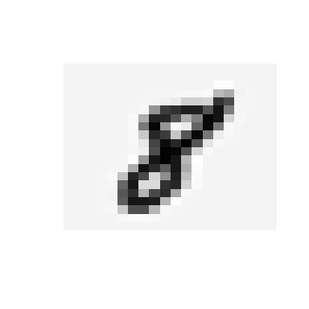
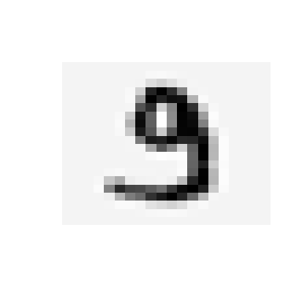

Neural Network: Feedforward propagation
================

Setup and import data
---------------------

This is an example from the machine learning class on coursera: <https://coursera.org/learn/machine-learning/>

It has been modified to run in R as the original example was for octave(matlab). The example data is in the repository.

``` r
library(dplyr)
load("data.Rdata")
load("weights.Rdata")
```

X represents the input data of 5000 images. It is a 5000 row by 400 column matrix (5000x400). Each row represents a 20x20 (ie 400 data points) image of a handwritten number from 0-9.

If we look at one row and reshape it, we can see an example:

``` r
rotate_clockwise<- function(x) { t(apply(x, 2, rev))}
show_image <- function(n){
  image(rotate_clockwise(matrix(X[n,],nrow = 20,ncol = 20)),
        axes = FALSE, useRaster = TRUE, col = grey(seq(1, 0, length = 256)))
}
show_image(4000)
```


``` r
show_image(4001)
```



y is a vector that corresponds to the actual human interpreted labels of the digits:

``` r
y[4000:4001]
```

    ## [1] 7 8

Pre-trained neural network
--------------------------

In this example we are using a pre-trained network, where the weights have been calculated for this problem using a training set and back propagation with a gradient descent algorithm.

There are 3 layers in the network. The first are the column values for each input of X (400 nodes), the second is the hidden layer with 26 nodes, and the third is the output layer with 10 nodes.

The weights (parameters) are in Theta1 and Theta2. Theta1 is a matrix of 25x401. Theta2 is a matrix of 10x26.

Calculating the predicted values
--------------------------------

To use an intercept term and do the matrix matrix multiplication we add a 1 for the input data X (401):

``` r
constant <- as_data_frame(cbind(1, 1:5000))
a1 <- cbind(constant$V1, X)
```

To shape the data in the way we need for the next layer we matrix multiply by a transposed Theta1 \[5000x401\] X \[401x25\] = \[5000x25\]:

``` r
z2 <- a1 %*%t(Theta1)
```

Next complete a sigmoid function to normalize between 0-1 values:

``` r
g <-  1.0 / (1.0 + exp(-z2))
```

These steps are repeated for each hidden layer. In this case there is only 1 hidden layer.

The output
----------

The output layer is calculated in the same steps with the output being a 5000X10 matrix where each column corresponds to the network's estimate on the likelihood the number is 0-9

``` r
a2 <- cbind(constant$V1, g)
z2 <- a2 %*%t(Theta2)
g2 <-  1.0 / (1.0 + exp(-z2))
```

The prediction for each record is the max value:

``` r
predicted_y <- as.matrix(max.col(g2, 'first'))
colnames(predicted_y) <- "predicted"
```

For the prior examples:

``` r
predicted_y[4000:4001]
```

    ## [1] 7 8

### Overall Accuracy

Combine predicted and actual to calculate accuracy:

``` r
actual_v_predicted <- as_tibble(cbind(y, predicted_y))%>%
  mutate(accurate = ifelse(y == predicted, 1, 0))

mean(actual_v_predicted$accurate)
```

    ## [1] 0.9752

An example for an incorrect prediction:

``` r
show_image(4991)
```



Actual is:

``` r
y[4991]
```

    ## [1] 9

Whereas predicted was:

``` r
predicted_y[4991]
```

    ## [1] 3
