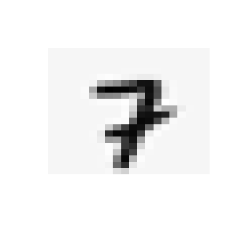

Neural Network: Feedforward propagation
================

Setup and import data
---------------------

This is an example from the machine learning class on coursera: &lt;coursera.org/learn/machine-learning/&gt;

It has been modified to run in R as the original example was for octave(matlab). The data is included for reference

``` r
library(dplyr)
load("data.Rdata")
load("weights.Rdata")
```

X represents the input data of 5000 images. It is a 5000 row by 400 row matrix. Each row is a 20x20 pixel image.

If we look at one row, we can see an example:

``` r
rotate_clockwise<- function(x) { t(apply(x, 2, rev))}
show_image <- function(n){
  image(rotate_clockwise(matrix(X[n,],nrow = 20,ncol = 20)), axes = FALSE)
}
show_image(4000)
```



``` r
show_image(4001)
```


y are the actual labels as intepreted by a human.

``` r
y[4000:4001]
```

    ## [1] 7 8

Pre trained weights
-------------------

In this example we are using a pre trained network, where the weights have been optimized for this problem.

There are 3 layers in the network. The first are the inputs of X, the second is the hidden layer with 25 nodes, and the third is the output layer with 10 nodes.

Theta1 are the weights for every input in the first layer of 400, whereas Theta2 are the weights for the second layer 25.

Calculating the predicted values
--------------------------------

To be able to do matrix matrix multiplication we need to add a constant for the input data:

``` r
constant <- as_data_frame(cbind(1, 1:5000))
a1 <- cbind(constant$V1, X)
```

First layer multiplies X inputs by Theta1:

``` r
z2 <- a1 %*%t(Theta1)
```

Then add the sigmoid function:

``` r
g <-  1.0 / (1.0 + exp(-z2))
```

This is repeated for each hidden layer. In this case there is only 1 hidden layer.

For the output layer it is a simliar process but the output is a vector 1:10 that corresponds to the models estimates for each likelihood that the number is either 0-9 (where 0 corresponds to 10)

``` r
a2 <- cbind(constant$V1, g)
z2 <- a2 %*%t(Theta2)
g2 <-  1.0 / (1.0 + exp(-z2))
```

The prediction for each record is the max value:

``` r
predicted_y <- as.matrix(max.col(g2, 'first'))
```

So for instance for the prior examples:

``` r
predicted_y[4000:4001]
```

    ## [1] 7 8

### Overall Accuracy

Combine data and summarize

``` r
predicted_y <- as.matrix(max.col(g2, 'first'))
colnames(predicted_y) <- "predicted"

actual_v_predicted <- as_tibble(cbind(y, predicted_y))%>%
  mutate(accurate = ifelse(y == predicted, 1, 0))

mean(actual_v_predicted$accurate)
```

    ## [1] 0.9752

An example for an incorrect prediction:

``` r
show_image(4991)
```


``` r
y[4991]
```

    ## [1] 9

``` r
predicted_y[4991]
```

    ## [1] 3
